<div align="center">

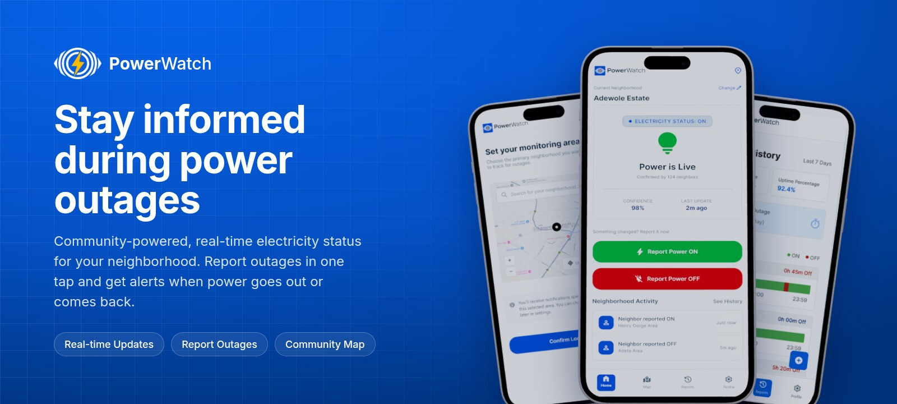

<h1>PowerWatch</h1>

<p><strong>Community-powered, real-time electricity status for your neighborhood.</strong><br />
Report an outage in one tap, see whether power is on before you get home, and get an alert the moment it goes out or comes back.</p>

<p>
  
  
  
  
  
</p>

<p>
  <a href="#getting-started">Getting started</a> ·
  <a href="#how-to-use-powerwatch">How to use it</a> ·
  <a href="#screens">Screens</a> ·
  <a href="#architecture">Architecture</a> ·
  <a href="#api">API</a>
</p>

</div>

---

## What is PowerWatch?

Power cuts are part of daily life in many Nigerian neighborhoods, and the only way to know whether the power is back is usually to go and check. PowerWatch turns the people on your street into a live power monitor:

1. **Neighbors report** when power goes on or off, with one tap.
2. **The server builds a consensus.** A neighborhood's status follows the majority of distinct people who reported in the last 30 minutes, so one wrong report can't flip it.
3. **Everyone following that neighborhood sees it at once.** They see the status, how many neighbors confirmed it and a confidence score, and they get a push notification when it changes.
4. **History adds up over time.** It builds a weekly record of outage hours, uptime and the longest outage for every area.

The project has three parts: the **mobile app** for Android and iPhone, the **API** that stores reports and sends alerts, and a **landing page** that explains the app and links to the stores.

## Contents

- [Features](#features)
- [How to use PowerWatch](#how-to-use-powerwatch)
- [Screens](#screens)
- [Light and dark mode](#light-and-dark-mode)
- [Landing page](#landing-page)
- [Architecture](#architecture)
- [Getting started](#getting-started)
- [Configuration](#configuration)
- [API](#api)
- [Project structure](#project-structure)
- [Design](#design)
- [Contributing](#contributing)

## Features

<table>
  <tr>
    <td width="33%" valign="top">
      <br />
      <strong>Real-time status</strong><br />
      See whether power is live in your neighborhood, how many neighbors confirmed it, the confidence score and the time of the last update.
    </td>
    <td width="33%" valign="top">
      <br />
      <strong>One-tap reporting</strong><br />
      Report power ON or OFF from the home screen. Each report carries a fresh GPS fix, and the server limits each person to one report per neighborhood every 5 minutes.
    </td>
    <td width="33%" valign="top">
      <br />
      <strong>Community map</strong><br />
      A live map of nearby neighborhoods coloured by status, and a heatmap of outages across your state.
    </td>
  </tr>
  <tr>
    <td valign="top">
      <br />
      <strong>Alerts you control</strong><br />
      Push notifications when power goes out or is restored. Outage alerts, restoration alerts and community updates each have their own switch.
    </td>
    <td valign="top">
      <br />
      <strong>Weekly history</strong><br />
      Total outage time, uptime percentage, your longest single outage and a day-by-day timeline of when power was on and off.
    </td>
    <td valign="top">
      <br />
      <strong>Your neighborhoods</strong><br />
      Pick a primary area on the map (or use your current location), and follow up to 10 saved neighborhoods.
    </td>
  </tr>
  <tr>
    <td valign="top">
      <br />
      <strong>Light and dark mode</strong><br />
      Follows your phone's setting, with a Dark Mode switch in Profile. The landing page has a matching theme toggle.
    </td>
    <td valign="top">
      <br />
      <strong>Account and devices</strong><br />
      Email sign-up with a 6-digit verification code, password reset, signed-in device management and account deletion.
    </td>
    <td valign="top">
      <br />
      <strong>Built-in help</strong><br />
      Help and FAQ, About, Terms and Privacy pages are inside the app.
    </td>
  </tr>
</table>

##  How to use PowerWatch

Setting up takes about two minutes. Every image below is the real screen from the PowerWatch design.

<table>
  <tr>
    <td width="33%" align="center" valign="top">
      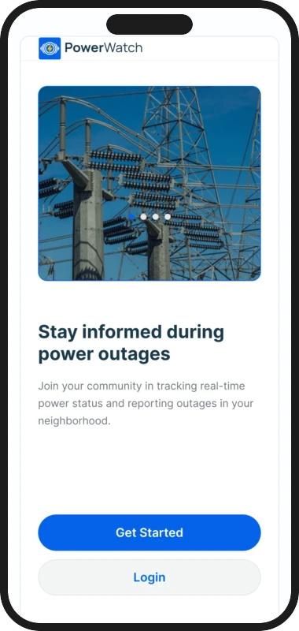<br />
      <strong>1. Open the app</strong><br />
      <sub>Tap <b>Get Started</b> to create an account, or <b>Login</b> if you already have one.</sub>
    </td>
    <td width="33%" align="center" valign="top">
      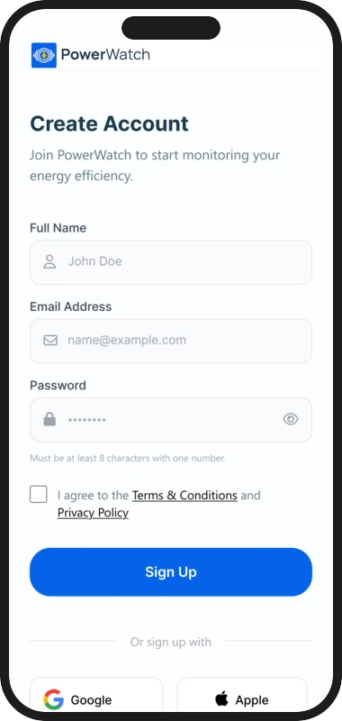<br />
      <strong>2. Create your account</strong><br />
      <sub>Enter your name, email and a password (8+ characters with upper and lower case letters, a number and a symbol), then accept the terms.</sub>
    </td>
    <td width="33%" align="center" valign="top">
      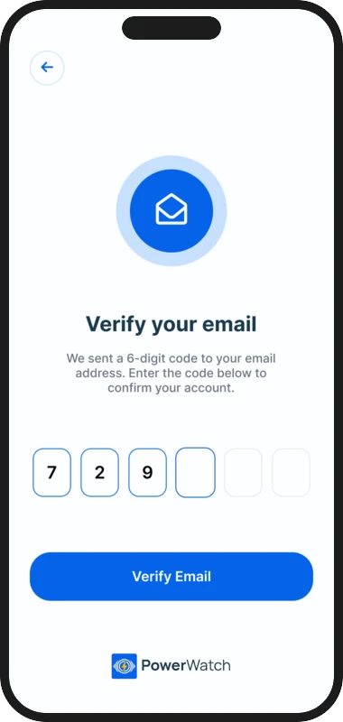<br />
      <strong>3. Verify your email</strong><br />
      <sub>Type the 6-digit code sent to your inbox. You can ask for a new code if it doesn't arrive.</sub>
    </td>
  </tr>
  <tr>
    <td align="center" valign="top">
      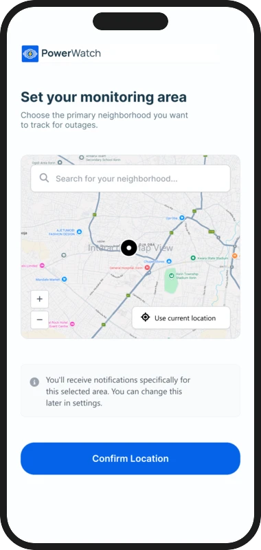<br />
      <strong>4. Set your monitoring area</strong><br />
      <sub>Search for your neighborhood or tap <b>Use current location</b>, drag the map until the pin sits on your exact spot, then tap <b>Confirm Location</b>.</sub>
    </td>
    <td align="center" valign="top">
      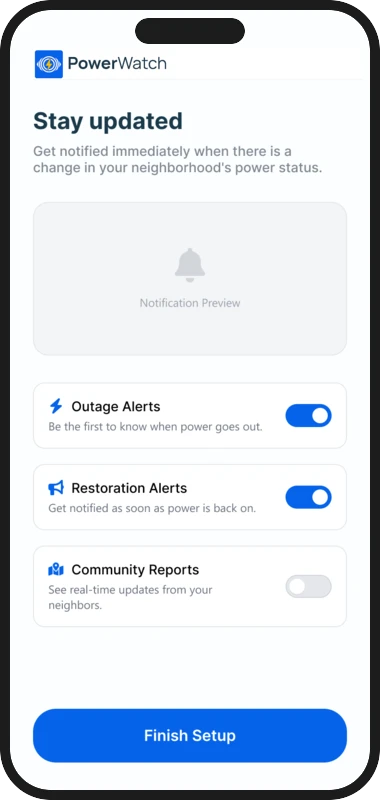<br />
      <strong>5. Choose your alerts</strong><br />
      <sub>Turn on outage alerts, restoration alerts and community reports, then tap <b>Finish Setup</b>.</sub>
    </td>
    <td align="center" valign="top">
      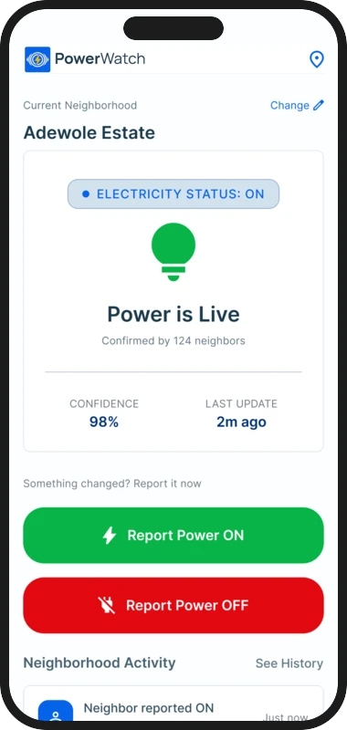<br />
      <strong>6. Check the status</strong><br />
      <sub>Home shows whether power is live, how many neighbors confirmed it, the confidence and the last update. Pull down to refresh.</sub>
    </td>
  </tr>
  <tr>
    <td align="center" valign="top">
      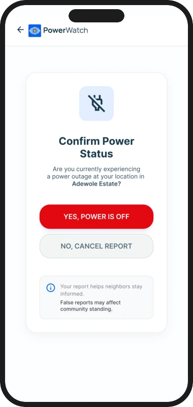<br />
      <strong>7. Report a change</strong><br />
      <sub>Power went off or came back? Tap <b>Report Power ON</b> or <b>Report Power OFF</b> on Home and confirm.</sub>
    </td>
    <td align="center" valign="top">
      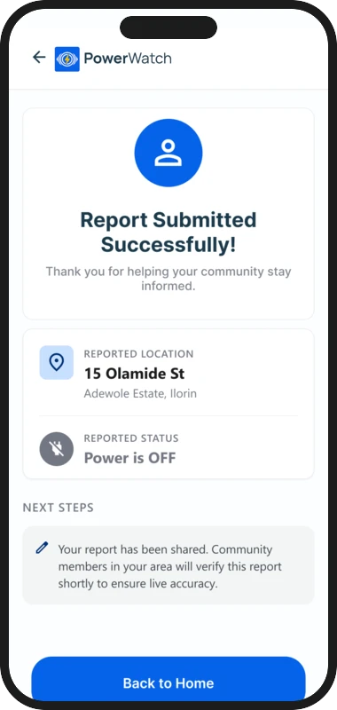<br />
      <strong>8. Neighbors confirm it</strong><br />
      <sub>Your report is shared with your area. The status changes once most recent reporters agree, and followers get an alert.</sub>
    </td>
    <td align="center" valign="top">
      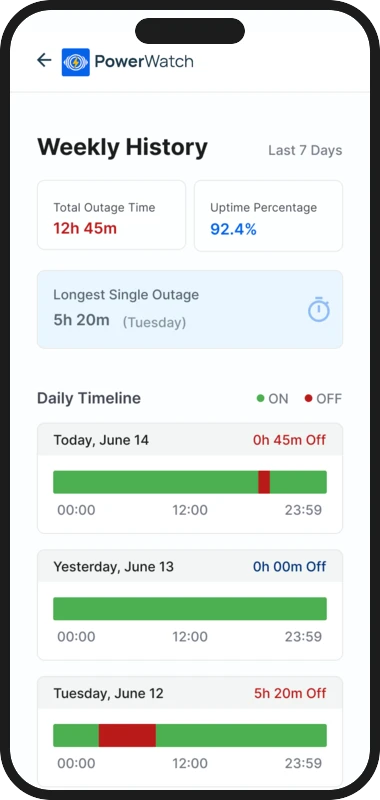<br />
      <strong>9. Look back at the week</strong><br />
      <sub>Open <b>Reports</b> for total outage time, uptime and a daily timeline. Load 30 days for a longer view.</sub>
    </td>
  </tr>
</table>

> [!TIP]
> Change your neighborhood at any time with **Change** on Home, or from **Profile → Primary Location**. Follow more places from **Profile → Manage Saved Neighborhoods**.

## Screens

<table>
  <tr>
    <td align="center">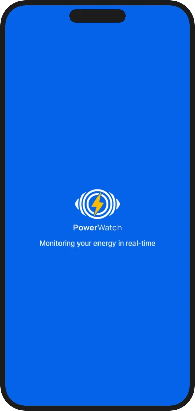<br /><sub>Splash</sub></td>
    <td align="center">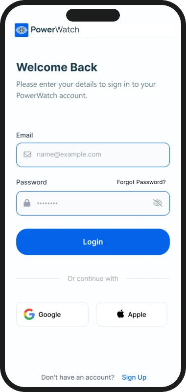<br /><sub>Login</sub></td>
    <td align="center"><br /><sub>Home (status hub)</sub></td>
    <td align="center">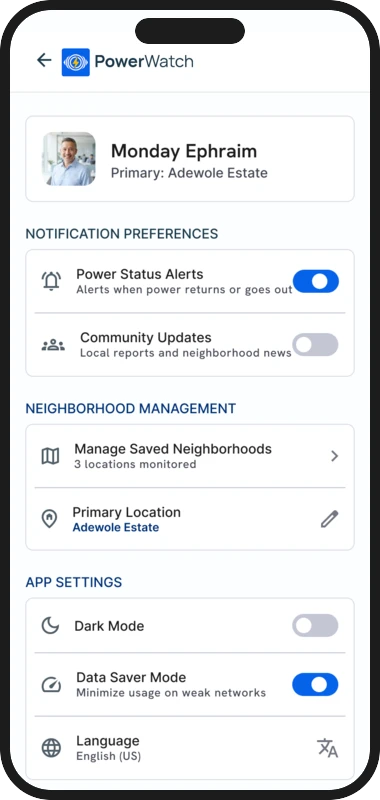<br /><sub>Profile and settings</sub></td>
  </tr>
</table>

The app also includes the Map and Heatmap, My Reports, Saved Neighborhoods, Notifications inbox, Signed-in Devices, Profile Settings, Language, Help and FAQ, About, Terms and Privacy screens. The full route list is in [`apps/mobile/README.md`](apps/mobile/README.md#screens).

##  Light and dark mode

PowerWatch follows your phone's appearance setting. To override it, use **Profile → App Settings → Dark Mode**; the choice is saved on the device. The map switches to dark map tiles too.

<table>
  <tr>
    <td align="center">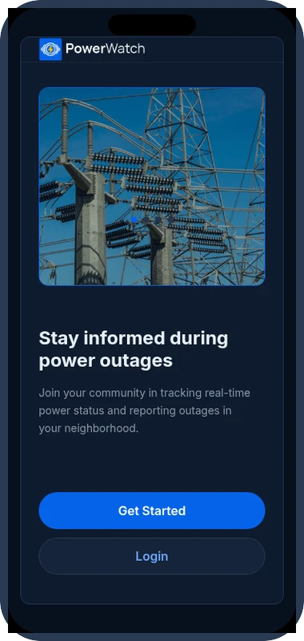</td>
    <td align="center">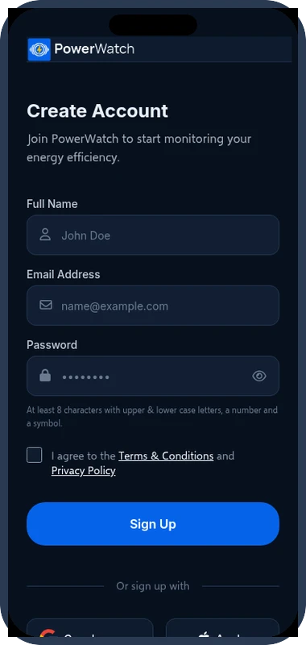</td>
    <td align="center">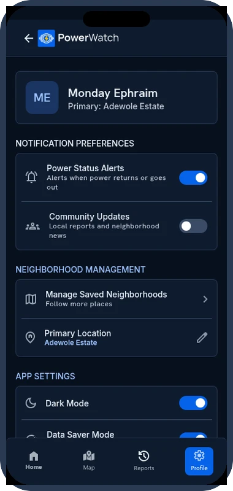</td>
  </tr>
</table>

##  Landing page

`apps/web` is the marketing site. It covers what PowerWatch is, a step-by-step walkthrough built from the app screens, a screen gallery, FAQ and App Store / Google Play download buttons. It follows the system theme, has its own light/dark toggle, and works from 320 px phones up to desktop.

<picture>
  <source media="(prefers-color-scheme: dark)" srcset="docs/readme/landing-dark.jpg" />
  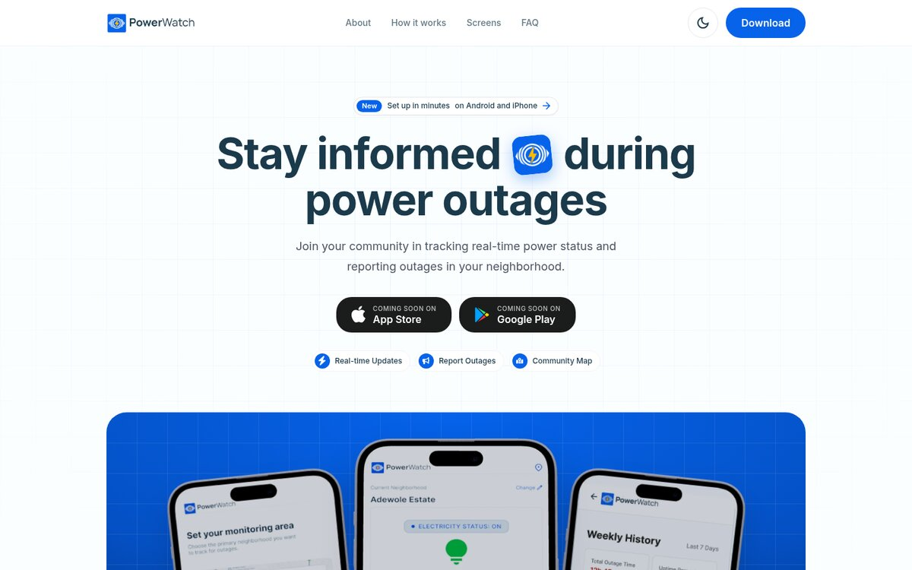
</picture>

##  Architecture

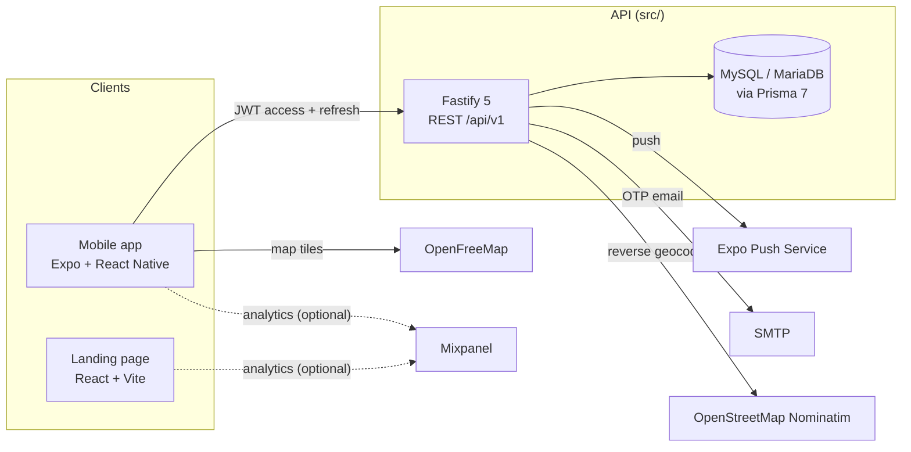

| Part | Stack | Where |
| --- | --- | --- |
| **Mobile app** | Expo SDK 57, React Native 0.86, React 19, Expo Router, MapLibre GL (in a WebView), expo-notifications, expo-location, SecureStore | [`apps/mobile`](apps/mobile) |
| **API** | Node.js, Fastify 5, Prisma 7 with the MariaDB adapter, Zod 4, JWT, bcrypt, Nodemailer, Expo Server SDK, Swagger UI | [`src`](src) |
| **Landing page** | React 19, Vite 8, Tailwind CSS 4 | [`apps/web`](apps/web) |

**How a report becomes a status**

1. The app sends `POST /api/v1/reports/power-on` or `power-off` with the neighborhood and a GPS fix.
2. The server rejects repeat reports from the same person within the cooldown (5 minutes by default).
3. The neighborhood's status becomes the majority of distinct reporters in the consensus window (30 minutes by default).
4. If the status flips, everyone whose primary or saved neighborhood it is gets a push notification, unless they turned that alert type off.

##  Getting started

### Prerequisites

- **Node.js 24** and npm
- **MySQL 8** or **MariaDB** running locally
- For the app: the **Expo Go** app on your phone, or an Android emulator / iOS simulator
- Optional: SMTP credentials (otherwise verification codes are printed in the API console during development)

### 1. Clone

```bash
git clone git@github.com:oyinlola-tech/PowerWatch.git
cd PowerWatch
```

### 2. Run the API

```bash
cd src
npm install
cp .env.example .env        # fill in DB_*, JWT_* secrets, CORS_ORIGIN and the rest
npm run prisma:generate
npm run prisma:push         # create the tables
npm run prisma:seed         # load Nigerian states, LGAs and towns
npm run dev                 # http://localhost:3000
```

Generate each JWT secret with:

```bash
node -e "console.log(require('crypto').randomBytes(64).toString('hex'))"
```

Outside production, interactive API docs are served at **http://localhost:3000/docs**.

### 3. Run the mobile app

```bash
cd apps/mobile
npm install
cp .env.example .env        # optional in development
npx expo start
```

Scan the QR code with Expo Go, or press `a` for Android or `i` for iOS. In development the app talks to the API on port 3000 of the computer running `expo start`, so keep your phone on the same Wi-Fi network.

> [!NOTE]
> If another program is already using port 3000, the app will reach that instead of the API. Either free the port, or set `EXPO_PUBLIC_API_URL` in `apps/mobile/.env` to your API's address.

### 4. Run the landing page

```bash
cd apps/web
npm install
cp .env.example .env        # optional: store links and analytics
npm run dev                 # http://localhost:5173
```

### Checks and builds

| Task | Command | Run in |
| --- | --- | --- |
| Type-check the app | `npx tsc --noEmit` | `apps/mobile` |
| Lint the app | `npx expo lint` | `apps/mobile` |
| Check Expo setup | `npx expo-doctor` | `apps/mobile` |
| Android build | `npx eas-cli@latest build --platform android` | `apps/mobile` |
| iOS build | `npx eas-cli@latest build --platform ios` | `apps/mobile` |
| Build the landing page | `npm run build`, then `npm run preview` | `apps/web` |
| Lint the landing page | `npm run lint` | `apps/web` |
| Build the API | `npm run build`, then `npm start` | `src` |
| Browse the database | `npm run prisma:studio` | `src` |

## Configuration

Each part reads its own `.env` file. Every variable is listed with comments in the matching `.env.example`.

<details>
<summary><strong>API</strong> (<code>src/.env</code>)</summary>

| Variable | Purpose |
| --- | --- |
| `PORT`, `HOST` | Where the server listens (default port 3000) |
| `DB_HOST`, `DB_PORT`, `DB_USER`, `DB_PASSWORD`, `DB_NAME` | MySQL / MariaDB connection |
| `JWT_ACCESS_SECRET`, `JWT_REFRESH_SECRET` | Token signing secrets (required) |
| `JWT_ACCESS_EXPIRES_IN`, `JWT_REFRESH_EXPIRES_IN` | Token lifetimes, e.g. `15m`, `30d` |
| `CORS_ORIGIN` | Comma-separated allowed origins (`*` is rejected) |
| `APP_TIMEZONE` | Time zone for "today" and daily history (default `Africa/Lagos`) |
| `REPORT_COOLDOWN_MINUTES` | Minutes between reports per person and neighborhood (default 5) |
| `REPORT_CONSENSUS_WINDOW_MINUTES` | Window used to decide the status (default 30) |
| `SMTP_*` | Email delivery for verification and reset codes |
| `EXPO_ACCESS_TOKEN` | Only if Expo "Enhanced push security" is on |
| `ADMIN_*` | Optional admin account created on first start |

Full reference: [`docs/api/configuration.md`](docs/api/configuration.md).

</details>

<details>
<summary><strong>Mobile app</strong> (<code>apps/mobile/.env</code>)</summary>

| Variable | Purpose |
| --- | --- |
| `EXPO_PUBLIC_API_URL` | API base URL. Leave empty in development; required for store builds. |
| `EXPO_PUBLIC_MIXPANEL_TOKEN` | Mixpanel token. Empty turns analytics off. |
| `EXPO_PUBLIC_SUPPORT_EMAIL` | Contact shown in the Terms and Privacy pages |

</details>

<details>
<summary><strong>Landing page</strong> (<code>apps/web/.env</code>)</summary>

| Variable | Purpose |
| --- | --- |
| `VITE_APP_STORE_URL`, `VITE_PLAY_STORE_URL` | Store listings. Empty shows "Coming soon" buttons. |
| `VITE_MIXPANEL_TOKEN` | Mixpanel token. Empty turns analytics off. |
| `VITE_SUPPORT_EMAIL` | Contact address shown on the site |

</details>

## API

All endpoints are under `/api/v1`. Signed-in requests send `Authorization: Bearer <access token>`.

| Area | Main endpoints |
| --- | --- |
| **Auth** | `POST auth/register`, `auth/login`, `auth/refresh-token`, `auth/verify-otp`, `auth/forgot-password`, `auth/reset-password` · `GET auth/me` · `PATCH auth/profile` |
| **Account** | `GET`/`PATCH auth/notification-preferences` · `PUT`/`DELETE auth/push-token` · `GET auth/sessions` · `POST auth/logout-all` · `DELETE auth/delete-account` |
| **Reports** | `POST reports/power-on`, `reports/power-off` · `GET reports/status`, `reports/activity`, `reports/my` |
| **Locations** | `GET locations/search`, `locations/status-map` · `POST locations/reverse-geocode` · `GET`/`POST locations/saved` |
| **History** | `GET history/summary?days=7\|30`, `history/weekly`, `history/monthly`, `history/power-timeline` |
| **Notifications** | `GET notifications`, `notifications/unread-count` · `PATCH notifications/:id/read`, `notifications/read-all` |
| **Admin** | Dashboard, analytics, users, locations, broadcasts, moderation (admin role only) |

Every endpoint is documented in [`docs/api`](docs/api/api.md) and in Swagger at `/docs`. The data model is described in [`docs/erd`](docs/erd/00-overview.md).

## Project structure

```text
PowerWatch/
├── apps/
│   ├── mobile/                 Expo app for Android and iPhone
│   │   ├── src/app/            Screens (Expo Router, one file per route)
│   │   ├── src/components/     UI, layout, map and icon components
│   │   ├── src/theme/          Light/dark palettes and the theme provider
│   │   ├── src/services/       API client, notifications, location, analytics
│   │   └── docs/               Figma spec and exported design assets
│   └── web/                    Landing page (React, Vite, Tailwind CSS)
├── src/                        API (Fastify, Prisma)
│   ├── routes/ controllers/ services/ repositories/
│   ├── prisma/                 Schema and seed data
│   └── server.ts
└── docs/
    ├── api/                    Endpoint reference and configuration
    ├── erd/                    Database design
    └── readme/                 Images used in this README
```

##  Design

The PowerWatch Figma file is the source of truth for every screen. Values read from Figma are in [`apps/mobile/docs/figma-spec.md`](apps/mobile/docs/figma-spec.md), and exported screens, images and icon vectors are in [`apps/mobile/docs/figma-export`](apps/mobile/docs/figma-export).

- **Colours:** brand blue `#0663EA`, text `#1B3A4B`, screen `#FBFEFF`, power ON `#07B447`, power OFF `#E20911`.
- **Type:** Inter, with Selawik standing in for Segoe UI.
- **Dark mode:** Figma only has light designs. The dark palette keeps the brand and status colours and swaps the neutrals for navy; it's documented in the [mobile README](apps/mobile/README.md#light-and-dark-mode).

## Contributing

1. Create a branch from `main`.
2. Keep light mode matching Figma. For colours, use theme tokens (`makeStyles` / `useTheme`) instead of hex values so dark mode keeps working.
3. Run the checks for the part you changed (see [Checks and builds](#checks-and-builds)).
4. Write small [Conventional Commits](https://www.conventionalcommits.org/), for example `feat(mobile): add saved neighborhoods screen`.
5. Open a pull request describing what changed and how you tested it, with screenshots for UI changes.

<div align="center">
  <br />
  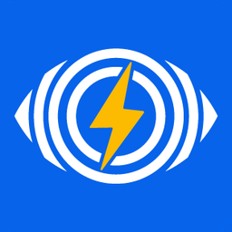<br />
  <sub>PowerWatch · Monitoring your energy in real-time</sub>
</div>
